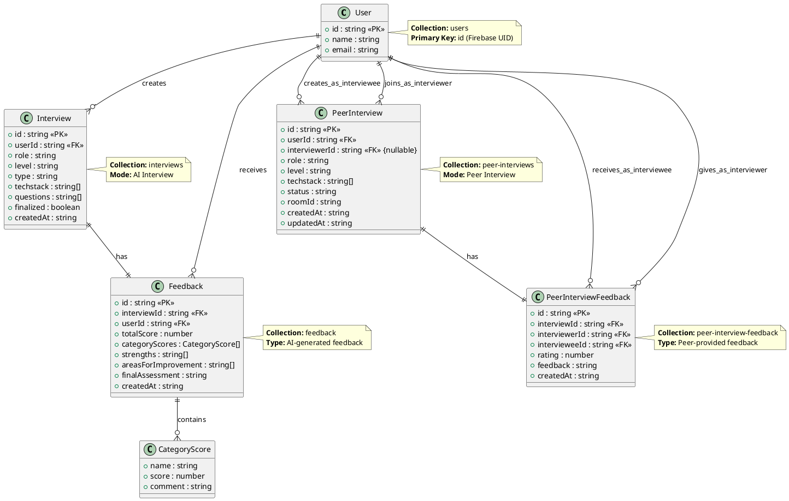
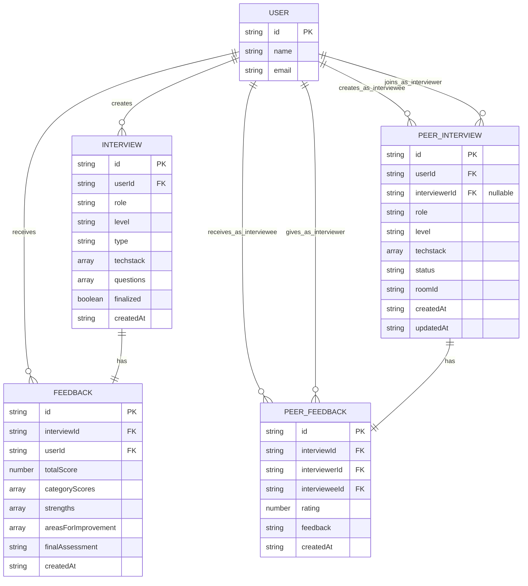
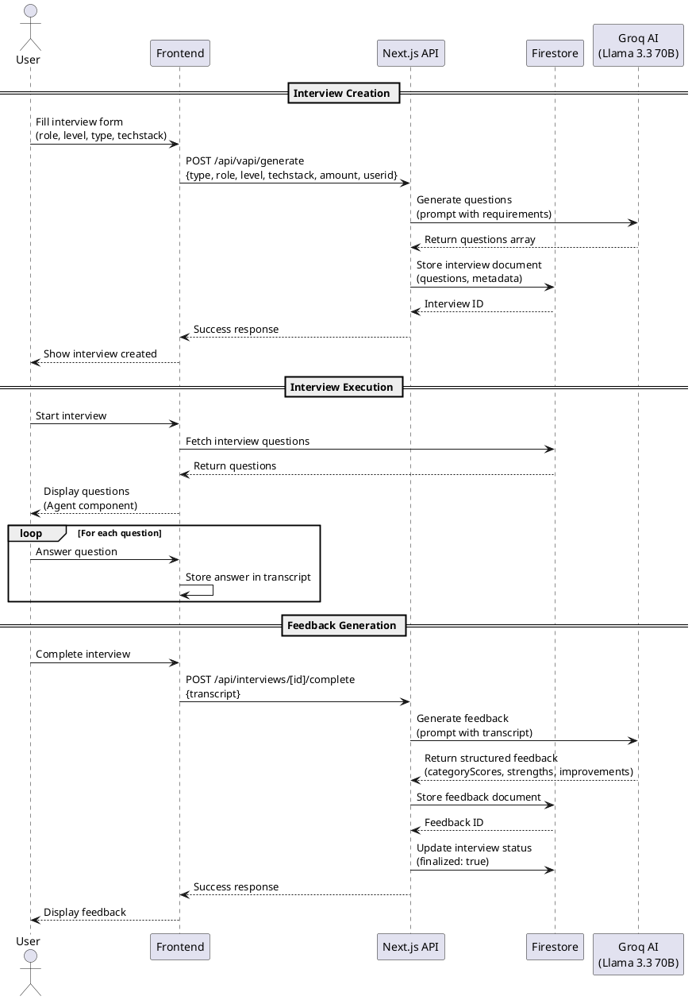
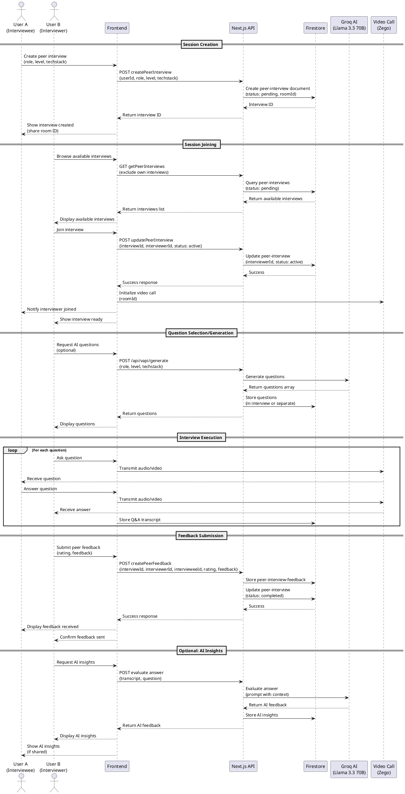
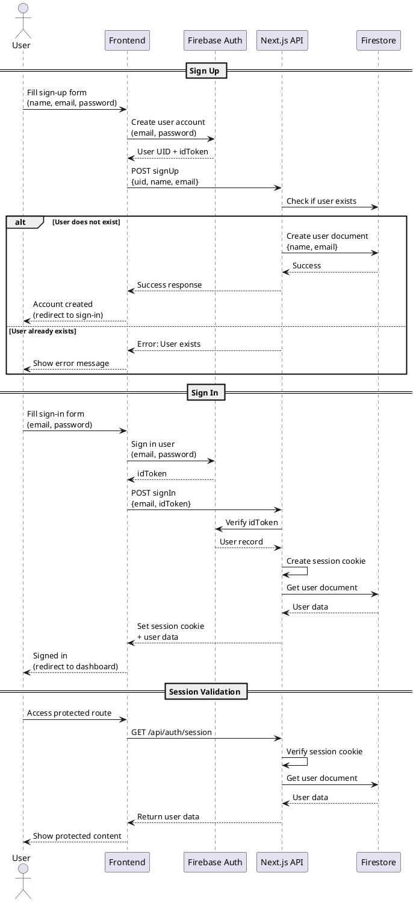
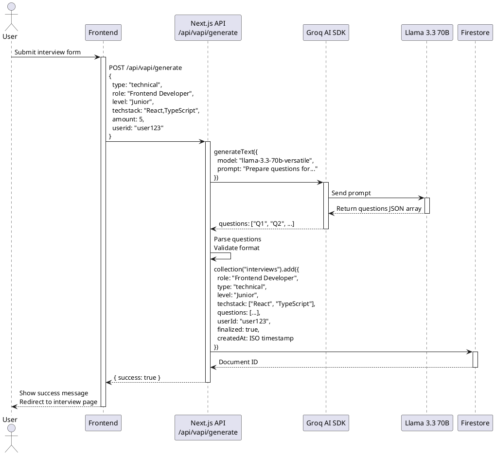
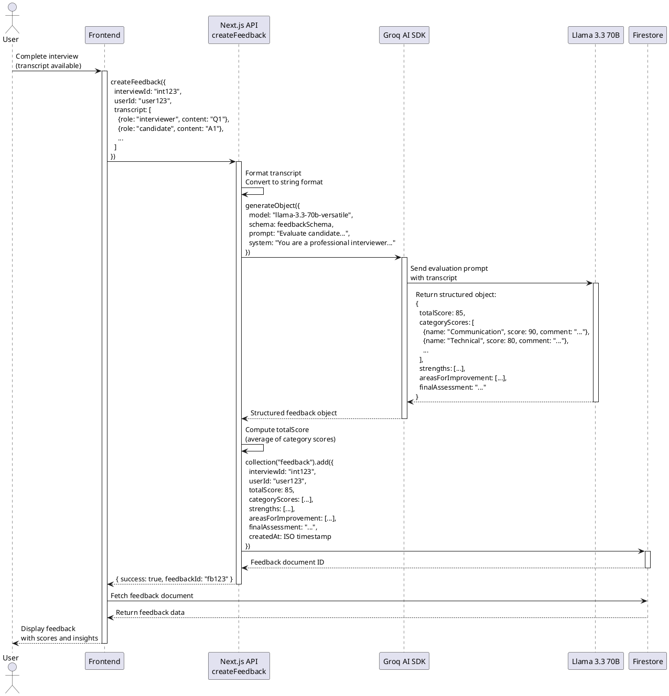
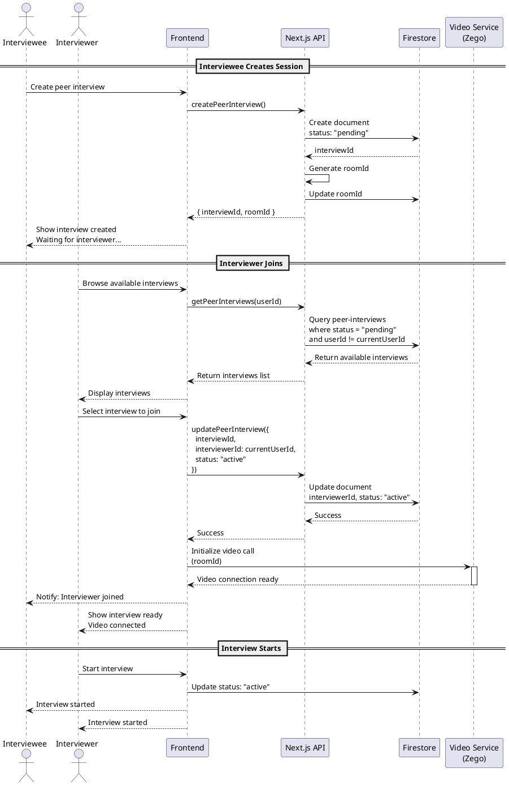

# Entity Relationship Diagram - Interview Prep Project

## Database Schema Overview

This project uses **Firebase Firestore** (NoSQL) as the database. The following diagram represents the logical entity relationships:

### UML Class Diagram (PlantUML)



### Standard UML Class Diagram Notation

```
┌─────────────────────────────────────────────────────────────┐
│                        USER                                 │
├─────────────────────────────────────────────────────────────┤
│ + id : string {PK}                                          │
│ + name : string                                              │
│ + email : string                                             │
└─────────────────────────────────────────────────────────────┘
         │
         │ 1
         │
         ├─────────────────────┐
         │                     │
         │ *                   │ *
         ▼                     ▼
┌──────────────────┐  ┌──────────────────────┐
│   INTERVIEW      │  │  PEER_INTERVIEW      │
├──────────────────┤  ├──────────────────────┤
│ + id : string {PK}│  │ + id : string {PK}   │
│ + userId : string│  │ + userId : string    │
│   {FK}           │  │   {FK}               │
│ + role : string  │  │ + interviewerId :    │
│ + level : string │  │   string {FK, null}  │
│ + type : string  │  │ + role : string       │
│ + techstack[]    │  │ + level : string      │
│ + questions[]    │  │ + techstack[]         │
│ + finalized :    │  │ + status : enum       │
│   boolean        │  │ + roomId : string     │
│ + createdAt :    │  │ + createdAt : string │
│   string         │  │ + updatedAt : string │
└──────────────────┘  └──────────────────────┘
         │                     │
         │ 1                   │ 1
         │                     │
         ▼                     ▼
┌──────────────────┐  ┌──────────────────────────┐
│    FEEDBACK      │  │ PEER_INTERVIEW_FEEDBACK  │
├──────────────────┤  ├──────────────────────────┤
│ + id : string {PK}│  │ + id : string {PK}       │
│ + interviewId :  │  │ + interviewId : string   │
│   string {FK}    │  │   {FK}                   │
│ + userId : string│  │ + interviewerId : string │
│   {FK}           │  │   {FK}                   │
│ + totalScore :   │  │ + intervieweeId : string │
│   number         │  │   {FK}                   │
│ + categoryScores:│  │ + rating : number        │
│   CategoryScore[]│  │ + feedback : string      │
│ + strengths[]    │  │ + createdAt : string     │
│ + areasFor       │  └──────────────────────────┘
│   Improvement[]  │
│ + finalAssessment│
│   : string       │
│ + createdAt :    │
│   string         │
└──────────────────┘

Legend:
PK = Primary Key
FK = Foreign Key
* = Many (0 or more)
1 = One
```

### Visual ER Diagram (Mermaid)



### ASCII ER Diagram

```
┌─────────────────────────────────────────────────────────────────────────┐
│                         INTERVIEW PREP DATABASE                         │
└─────────────────────────────────────────────────────────────────────────┘

┌──────────────┐
│    USER      │
├──────────────┤
│ id (PK)      │◄──────┐
│ name         │       │
│ email        │       │
└──────────────┘       │
                       │
                       │
        ┌──────────────┼──────────────┐
        │              │              │
        │              │              │
        ▼              ▼              ▼
┌──────────────┐ ┌──────────────────┐ ┌──────────────────┐
│  INTERVIEW   │ │ PEER_INTERVIEW   │ │     USER         │
│  (AI Mode)   │ │  (Peer Mode)     │ │   (Profile)      │
├──────────────┤ ├──────────────────┤ ├──────────────────┤
│ id (PK)      │ │ id (PK)          │ │ (same as User)   │
│ userId (FK)  │◄─┤ userId (FK)     │◄─┤                  │
│ role         │ │ interviewerId    │ │                  │
│ level        │ │   (FK, nullable) │ │                  │
│ type         │ │ role             │ │                  │
│ techstack[]  │ │ level            │ │                  │
│ questions[]  │ │ techstack[]      │ │                  │
│ finalized    │ │ status           │ │                  │
│ createdAt    │ │ roomId           │ │                  │
└──────────────┘ │ createdAt        │ │                  │
        │        │ updatedAt        │ │                  │
        │        └──────────────────┘ └──────────────────┘
        │                  │
        │                  │
        ▼                  ▼
┌──────────────┐ ┌──────────────────────┐
│   FEEDBACK   │ │ PEER_INTERVIEW_      │
│  (AI Mode)   │ │    FEEDBACK          │
├──────────────┤ ├──────────────────────┤
│ id (PK)      │ │ id (PK)              │
│ interviewId  │◄─┤ interviewId (FK)    │◄─┐
│   (FK)       │ │ interviewerId (FK)   │  │
│ userId (FK)  │◄─┤ intervieweeId (FK)  │  │
│ totalScore   │ │ rating               │  │
│ categoryScores│ │ feedback             │  │
│   []         │ │ createdAt            │  │
│ strengths[]  │ └──────────────────────┘  │
│ areasFor     │                          │
│ Improvement[]│                          │
│ finalAssessment│                        │
│ createdAt    │                          │
└──────────────┘                          │
                                          │
                                          │
                                          │
                    ┌─────────────────────┘
                    │
                    │ (references PeerInterview)
                    │
                    └─────────────────────┐
                                          │
                                          │
                    ┌─────────────────────┘
                    │
                    │ (references User as interviewer)
                    │
                    └─────────────────────┐
                                          │
                                          │
                    ┌─────────────────────┘
                    │
                    │ (references User as interviewee)
                    │
                    └─────────────────────┐
                                          │
                                          │
                                          ▼
```

## Entity Details

### 1. **USER** (users collection)
- **Primary Key**: `id` (Firebase UID)
- **Attributes**:
  - `id`: string (Firebase UID)
  - `name`: string
  - `email`: string
- **Relationships**:
  - One-to-Many with `INTERVIEW` (creates interviews)
  - One-to-Many with `PEER_INTERVIEW` (creates peer interviews)
  - One-to-Many with `FEEDBACK` (receives feedback)
  - One-to-Many with `PEER_INTERVIEW_FEEDBACK` (as interviewer or interviewee)

### 2. **INTERVIEW** (interviews collection) - AI Interview Mode
- **Primary Key**: `id` (Firestore document ID)
- **Attributes**:
  - `id`: string
  - `userId`: string (FK → User.id)
  - `role`: string (e.g., "Frontend Developer")
  - `level`: string (e.g., "Junior", "Senior")
  - `type`: string (e.g., "technical", "behavioral")
  - `techstack`: string[] (array of technologies)
  - `questions`: string[] (array of interview questions)
  - `finalized`: boolean
  - `createdAt`: string (ISO timestamp)
- **Relationships**:
  - Many-to-One with `USER` (created by user)
  - One-to-One with `FEEDBACK` (has feedback after completion)

### 3. **FEEDBACK** (feedback collection) - AI Interview Feedback
- **Primary Key**: `id` (Firestore document ID)
- **Attributes**:
  - `id`: string
  - `interviewId`: string (FK → Interview.id)
  - `userId`: string (FK → User.id)
  - `totalScore`: number (0-100)
  - `categoryScores`: Array<{name: string, score: number, comment: string}>
    - Categories: Communication Skills, Technical Knowledge, Problem Solving, Cultural Fit, Confidence and Clarity
  - `strengths`: string[]
  - `areasForImprovement`: string[]
  - `finalAssessment`: string
  - `createdAt`: string (ISO timestamp)
- **Relationships**:
  - Many-to-One with `INTERVIEW` (belongs to interview)
  - Many-to-One with `USER` (belongs to user)

### 4. **PEER_INTERVIEW** (peer-interviews collection) - Peer Interview Mode
- **Primary Key**: `id` (Firestore document ID)
- **Attributes**:
  - `id`: string
  - `userId`: string (FK → User.id, the interviewee/creator)
  - `interviewerId`: string | null (FK → User.id, nullable until someone joins)
  - `role`: string (job role)
  - `level`: string (experience level)
  - `techstack`: string[] (array of technologies)
  - `status`: 'pending' | 'active' | 'completed'
  - `roomId`: string (unique room ID for video call)
  - `createdAt`: string (ISO timestamp)
  - `updatedAt`: string (ISO timestamp)
- **Relationships**:
  - Many-to-One with `USER` (created by user as interviewee)
  - Many-to-One with `USER` (interviewerId references User as interviewer)
  - One-to-One with `PEER_INTERVIEW_FEEDBACK` (has feedback after completion)

### 5. **PEER_INTERVIEW_FEEDBACK** (peer-interview-feedback collection)
- **Primary Key**: `id` (Firestore document ID)
- **Attributes**:
  - `id`: string
  - `interviewId`: string (FK → PeerInterview.id)
  - `interviewerId`: string (FK → User.id)
  - `intervieweeId`: string (FK → User.id)
  - `rating`: number (rating score)
  - `feedback`: string (text feedback)
  - `createdAt`: string (ISO timestamp)
- **Relationships**:
  - Many-to-One with `PEER_INTERVIEW` (belongs to peer interview)
  - Many-to-One with `USER` (interviewerId references User as interviewer)
  - Many-to-One with `USER` (intervieweeId references User as interviewee)

## Relationship Summary

| Relationship | Type | Description |
|-------------|------|-------------|
| User → Interview | One-to-Many | A user can create multiple AI interviews |
| User → PeerInterview | One-to-Many | A user can create multiple peer interviews |
| Interview → Feedback | One-to-One | Each AI interview can have one feedback |
| PeerInterview → PeerFeedback | One-to-One | Each peer interview can have one feedback |
| User → Feedback | One-to-Many | A user can receive multiple feedbacks |
| User → PeerFeedback (as interviewer) | One-to-Many | A user can give multiple peer feedbacks |
| User → PeerFeedback (as interviewee) | One-to-Many | A user can receive multiple peer feedbacks |
| User → PeerInterview (as interviewer) | One-to-Many | A user can join multiple peer interviews as interviewer |

## Collection Names in Firestore

1. **users** - User profiles
2. **interviews** - AI-generated interviews
3. **feedback** - AI interview feedback
4. **peer-interviews** - Peer interview sessions
5. **peer-interview-feedback** - Peer interview feedback

## Notes

- Firebase Firestore is a NoSQL database, so relationships are maintained through foreign key references (document IDs)
- The `interviewerId` in `PEER_INTERVIEW` is nullable initially (null when status is 'pending')
- When a peer interview is completed, the status changes to 'completed' and feedback is created
- Both AI and Peer interview modes have separate feedback systems
- The `roomId` in `PEER_INTERVIEW` is used for video call integration (e.g., Zego)

---

## Sequence Diagrams

### 1. AI Interview Flow - Complete Interview Process



### 2. Peer Interview Flow - Session Creation and Interview



### 3. User Authentication Flow



### 4. Interview Generation Flow (Detailed)



### 5. Feedback Generation Flow (Detailed)



### 6. Peer Interview Join Flow



